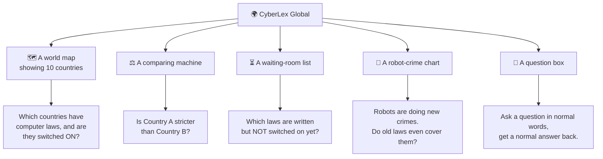
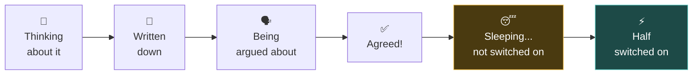
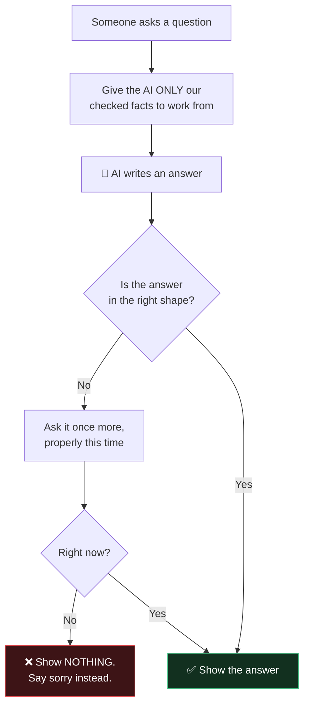
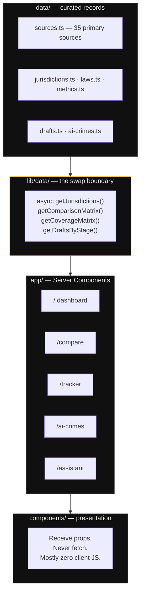
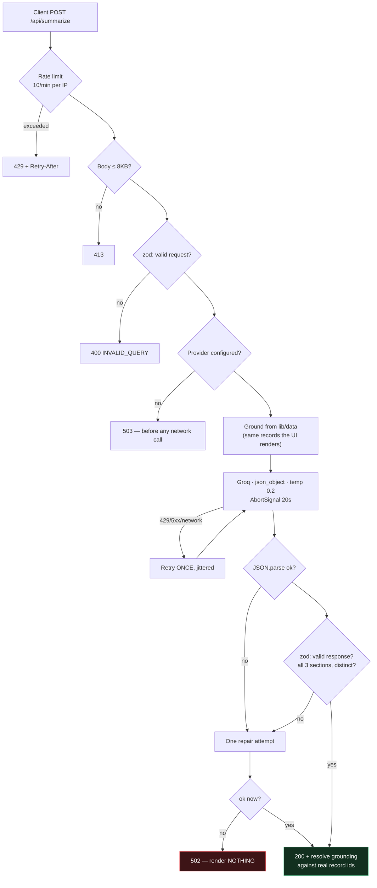

# CyberLex Global — The Pitch

> **Read this in two halves.**
> **Part 1** explains everything with no technical words at all.
> **Part 2** explains the same thing for engineers.
>
> If you only read one page, read Part 1.

---
---

# PART 1 — The Simple Version

## 🍪 First, a story about cookies

Imagine your mum writes a new house rule on a piece of paper:

> **"No cookies before dinner."**

She writes it. She signs it. She sticks it on the fridge.

But then she says: *"This rule starts next month."*

So — **is the rule real right now?**

**No.** The rule *exists*. It is written down. But today, you can still eat the cookie. Nobody can tell you off.

**This tiny idea is the whole project.**

```
┌─────────────────────┐        ┌─────────────────────┐
│  The rule is        │        │  The rule can       │
│  WRITTEN            │  ───▶  │  ACTUALLY STOP YOU  │
│                     │        │                     │
│  📝 on the fridge   │        │  🚫 no cookie!      │
└─────────────────────┘        └─────────────────────┘
         │                                │
         └────────── THE GAP ─────────────┘
              ↑
     Nobody keeps track of this gap.
     CyberLex Global does.
```

---

## 🌍 Now make it bigger

Countries write rules too. Big ones — about computers, hacking, your private data, and artificial intelligence.

These are called **laws**.

And countries do exactly the same thing your mum did:

- They write the law ✍️
- They sign the law ✅
- **And then they don't switch it on.** 🔌❌

Sometimes for *years*.

So a company might panic and spend a lot of money following a law… that isn't switched on yet.

Or worse — a company ignores a law, and one day it **is** switched on, and now they're in big trouble.

**Nobody was keeping a proper list of which laws are switched on and which are not.**

That is what this website does.

---

## 🏗️ What the website actually is

Think of it as a **big wall map with a lot of sticky notes**.



---

## 🧩 The five parts, one at a time

### 1️⃣ The Map — "Who has what?"

A dark map of the world. Ten countries glow.

Each glowing country has a **coloured dot**:

| Dot | Means | In cookie language |
|:---:|---|---|
| 🟢 Green | The law is switched **ON** | No cookie. Really. |
| 🔵 Teal | **Half** switched on | Some cookies allowed |
| 🟡 Yellow | Written but **NOT** switched on | Cookie is still fine 🍪 |
| 🟠 Orange | Still being written | Not even a rule yet |

Next to the map is a list. Each country also gets a **score out of 100** — how strict it is.

> China 86 · EU 82 · Singapore 69 · Japan 49

Higher number = stricter country.

---

### 2️⃣ The Comparing Machine — "Who is tougher?"

Pick two or three countries. The website puts them side by side, like comparing trading cards.

```
                 EUROPE          INDIA         SINGAPORE
 Jail time       2 years         3 years ★     2 years
 Fine            $11M            $30M ★        $10M
 Tell them in    24 hours        6 hours       2 hours ★
                                                  ↑
                                          strictest one
                                          gets a star
```

That last row is important. If a company gets hacked, **how fast must it tell the government?**

Singapore says: **2 hours.**

Two hours! That's shorter than a movie. 😳

---

### 3️⃣ The Waiting Room — "Not switched on yet"

This is the special one. The bit nobody else does.

A list of laws that are **written but sleeping**. 😴

And for each one, it says **why** it's still asleep:

- "Still waiting for the small print to be written"
- "Waiting for someone to sign the final paper"
- "It's coming in stages — a bit this year, a bit next year"



The two boxes on the right are the ones people forget about. **That's the whole point of this website.**

---

### 4️⃣ The Robot-Crime Chart — "Do old rules still work?"

Here's the problem.

Most computer laws were written a **long** time ago. The UK's main one is from **1990** — before most people had the internet.

Now robots (AI) can do brand-new sneaky things:

- 🎭 **Pretend to be your boss** using a fake video of their face
- 🦠 **Make viruses that change shape** so nobody recognises them
- 🍯 **Trick a helpful robot** into doing something bad
- 🧪 **Poison what a robot learns**, so it grows up wrong

So we made a big grid. Techniques down the side, countries across the top:

```
                     EU   US   UK   IN   SG   CN   JP   AU   BR   AE
 Shape-shifting virus ✓    ✓    ✓    ✓    ✓    ✓    ≈    ✓    ≈    ≈
 Fake videos          ✓    ≈    ≈    ≈    ≈    ✓    –    ≈    –    ≈
 Tricking a robot     ≈    ≈    ≈    ≈    ≈    ≈    ∅    ∅    ∅    –

   ✓ = old law covers it properly
   ≈ = old law sort of stretches to cover it (a bit wobbly)
   ∅ = NO law covers it. Nothing. 😬
   – = we haven't checked yet (and we say so!)
```

Look at that bottom row. **Tricking a robot** — three countries have *no law at all* for it.

That's not a mistake in the website. **That's the finding.** That's the useful bit.

---

### 5️⃣ The Question Box — "Just ask it"

A box where you type a normal question:

> *"Is India's new data law switched on yet?"*

And it writes back in three neat parts:

1. **What it is** — a short explanation
2. **What happens if you break it** — the punishment
3. **What you should do** — a small to-do list

---

## 🛡️ The most important part of the whole project

The question box uses **AI**. And AI has a famous bad habit:

> **When it doesn't know something, it makes something up — confidently.**

For a website about *the law*, that would be terrible. Someone could make a real decision based on a made-up fine.

So we built a rule:



**We would rather show nothing than show something wrong.**

### And we tested that it actually works

In our data, Japan's reporting deadline is marked *"we haven't looked this up yet."*

So we asked the AI: **"What is Japan's deadline?"**

A lying AI would have invented a number. Ours said:

> *"The breach reporting deadline in Japan is not established in the provided context."*

🎉 It admitted it didn't know. **That's the win.**

---

## 🙋 One honest thing

Right at the top of every single page, there's a small counter:

> **● 65 unverified**

That means: *65 facts on this website were written from research, but a real lawyer hasn't double-checked them yet.*

We could have hidden that. **We put it on every page instead.**

Because a website about the law that lies about how sure it is… is worse than no website at all.

---

## 🎯 Part 1 in one breath

> Countries write computer laws.
> Sometimes they forget to switch them on.
> Nobody was tracking that.
> Now something does — on a map, with scores, side-by-side comparisons, a robot-crime chart, and a question box that admits when it doesn't know.

---
---

# PART 2 — The Technical Version

## Problem statement

Cyber law is fragmented across jurisdictions, and three failures compound:

1. **Discovery is fragmented.** Primary sources are scattered across EUR-Lex, national gazettes, ministry PDFs and parliamentary trackers. No normalised view exists of "what is the primary cyber statute in jurisdiction X, and is it actually in force?"

2. **"Passed" ≠ "in force."** An instrument can receive assent and remain legally inert for years pending notification, gazetting or commencement. Teams either over-comply with something unenforceable, or get blindsided when a dormant act commences. **Almost no public tool models this distinction.**

3. **Comparison is manual and unquantified.** "Is Singapore stricter than India on breach reporting?" is currently a lawyer-hours question.

Plus a fourth, emerging: **AI-enabled attack techniques are outrunning the statutes drafted to address them.**

---

## What shipped

| | |
|---|---|
| **Jurisdictions** | 10 (US, EU, UK, IN, SG, CN, JP, AU, BR, AE) |
| **Statutes tracked** | 27 |
| **Tracker entries** | 12 (unnotified acts + bills in pipeline) |
| **AI-crime techniques** | 6, mapped across all 10 jurisdictions = **60 coverage cells** |
| **Primary sources** | 35, all official publishers |
| **Comparator metrics** | 14 rows × N jurisdictions |
| **Source files** | 108 TypeScript/TSX · 46 components |
| **Runtime dependencies** | 20 |

---

## Architecture



**The boundary is enforced, not merely documented.** An ESLint `no-restricted-imports` rule blocks `@/data/*` anywhere outside `lib/data/`, and it's verified firing. Every repository function is `async` despite the data being static today — so swapping in a database changes one directory and zero components.

---

## Stack

| Layer | Choice | Why |
|---|---|---|
| Framework | **Next.js 16.3.1** (App Router) | Server Components keep the whole dataset off the client. Route Handlers keep the API key server-side without a separate backend. |
| Runtime | React 19.2.8, TypeScript 5 `strict` | No `any` anywhere; the domain is dense enough that discriminated unions earn their keep |
| Styling | **Tailwind v4** (CSS-first `@theme`) | Design tokens are simultaneously utilities *and* real CSS variables. No `tailwind.config.ts`. |
| Map | **d3-geo + world-atlas** topojson | Projected at module scope **on the server** — verified zero references in client chunks. The map costs **0 KB client JS**. |
| AI | **Groq** `openai/gpt-oss-120b` | Fast inference; model id is env-configurable |
| Validation | **zod** | Env, request bodies, and — most importantly — LLM output |
| Motion | motion · gsap | Restrained; all disabled under `prefers-reduced-motion`. Scrolling is native — smooth-scroll hijacking was removed after it broke the mouse wheel. |
| Primitives | shadcn/radix, re-skinned | Accessibility correctness we didn't want to hand-roll |

---

## Data modelling — the interesting decisions

### `Known<T>` — three states, not two

```ts
type Known<T> =
  | { kind: "known"; value: T }
  | { kind: "no-provision" }     // the jurisdiction genuinely has no such rule
  | { kind: "not-researched" };  // we have not established it
```

`null` would collapse two **completely different legal claims** into one blank cell. "There is no such law" and "we didn't check" must never look alike. The UI renders them distinctly — red vs grey, different wording — and conflating them is treated as a correctness bug.

**Consequence:** 5 of 60 coverage cells are genuine `no-coverage`, and 5 are `not-researched`. Both visible. Neither guessed.

### Strictness scoring

Six weighted dimensions, plain weighted mean, **published in full** at `/methodology`:

```
criminalExposure       0.20      enforcementIntensity   0.17
corporateFinancial     0.20      aiGovernance           0.15
reportingBurden        0.18      extraterritorialReach  0.10
```

`weights.ts` **throws at import** if they stop summing to 1. The score is labelled a *comparative indicator, never a measurement*, and the detail page shows per-dimension contributions so a contested score can be argued with at the level it was built.

---

## The AI pipeline



### Why `json_object` and not `json_schema`

Groq's structured-output enforcement is **reported to be silently ignored** on gpt-oss models, returning free-form prose. Relying on it would mean trusting a guarantee the provider doesn't reliably keep.

So: ask for JSON, then **validate it ourselves** and repair once. A provider regression degrades to a designed error state instead of rendering garbage as legal information.

### Grounding is resolved, never trusted

The model returns `groundedOn: { jurisdictions, lawIds }`. We don't believe it:

- `lawIds` filtered against real law records
- `jurisdictions` **derived from the cited laws**, not taken at face value

This kills two bugs at once — hallucinated codes producing dead in-app links, and correctly-cited answers silently losing their attribution because the model left the array empty.

---

## Security

`GROQ_API_KEY` is read in **exactly one file** (`lib/env.ts`), which carries the `server-only` guard — an accidental client import becomes a **build failure**, not a production leak.

**Verified against the production bundle:**

| Check | Result |
|---|---|
| `GROQ_API_KEY` literal in client chunks | **0** |
| `gsk_` key pattern in client chunks | **0** |
| The live key value in `.next/static` | **0** |
| `groq-sdk` bundled client-side | **0** |

---

## Failure handling

**14 failure modes** were specified up front and built **before** the happy path — because they are the majority of the real work.

**11 verified live**, including: our rate limit (429 + counting-down `Retry-After`), timeout, upstream 4xx/auth, malformed JSON, schema mismatch, duplicate headings, empty sections, provider-unconfigured, oversized payload, invalid query, wrong method.

Two design points worth calling out:

- **Retry exactly once** — on 429/5xx/network/first-malformed. **Never** on timeout, non-429 4xx, or a second malformed response. The entire retry budget lives inside the 20s `AbortSignal`, so total server time is bounded.
- **Graceful degradation is real.** With the key removed, all four curated modules return 200 and `/assistant` renders a designed unavailable state. An AI outage degrades exactly one route.

---

## Design system — "Obsidian"

| | |
|---|---|
| Ground | `#000000` — true black, warm-neutral greys, never blue-shifted |
| Brand | **Bone** `#F2EFE9` — off-white |
| Type | Instrument Serif (display) · Geist (UI) · Geist Mono (all labels + data) |
| Structure | Hairlines and negative space. **No cards.** Radii 2–4px. |

**The key structural decision:** making the brand colour bone frees *every* hue for legal-status semantics. Nothing is both an accent and a data value, so no colour ever means two things.

Accessibility: WCAG 2.2 AA verified by computing contrast on **composited** backgrounds — which caught a token that failed at 4.31:1 while the docs claimed it passed. Colour never carries meaning alone; every status has a word.

---

## Rendering

```
○ Static     /tracker · /ai-crimes · /methodology · /assistant · sitemap · robots
● SSG        10 jurisdiction pages + 6 technique pages (generateStaticParams)
ƒ Dynamic    / and /compare (URL-driven filters) · both API routes
```

`dynamicParams = false` on both dynamic routes — without it, Next prerendered `notFound()` and served 404 pages with **HTTP 200**, a soft 404 that search engines penalise. *Dev mode does not reproduce this.*

---

## What's honest about this project

**65 records are marked `needs-review`.** They were authored from structural knowledge and are cited, but not line-by-line verified against primary sources by someone with legal training.

We could have marked them `verified`. Instead:

- The count sits in the masthead **on every page**
- `/methodology` explains exactly what it means
- Every module carries a non-dismissible disclaimer
- Unresearched figures render as **visible gaps**

`verification` is per-record, so the count falls as records are checked. A lawyer is needed only for the genuinely contestable interpretations — the `analogical` coverage claims and the strictness scores. The rest is careful reading of public documents.

> **A tool about the law that overstates its own certainty is worse than no tool at all.**

---

## Status

✅ All 8 phases complete · `tsc` clean · `eslint` clean · production build clean
✅ Assistant verified end-to-end in production mode (~0.96s)
✅ Security gate passed
⏳ Not yet deployed · 65 records pending verification

---

*Full documentation: [`docs/prd.md`](docs/prd.md) · [`docs/architecture.md`](docs/architecture.md) · [`docs/rules.md`](docs/rules.md) · [`docs/design.md`](docs/design.md) · [`docs/phases.md`](docs/phases.md) · [`docs/memory.md`](docs/memory.md)*
